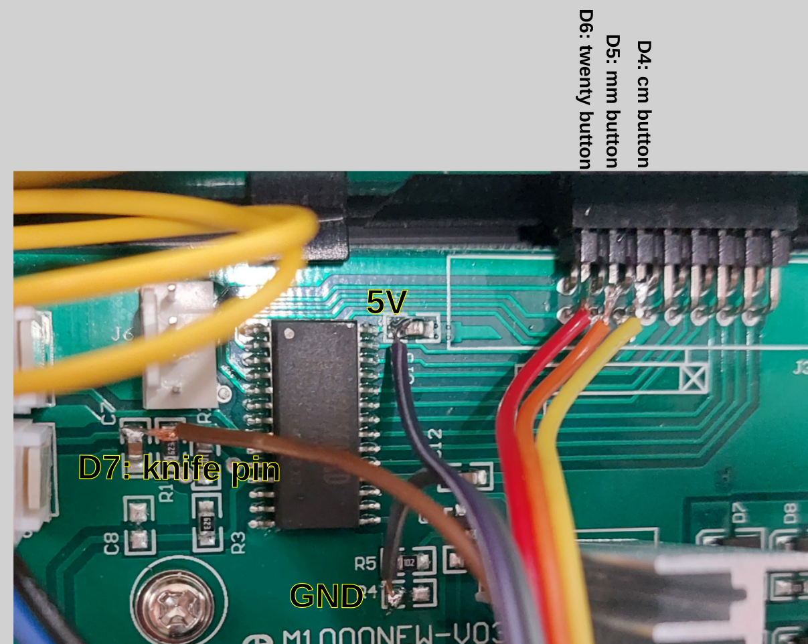
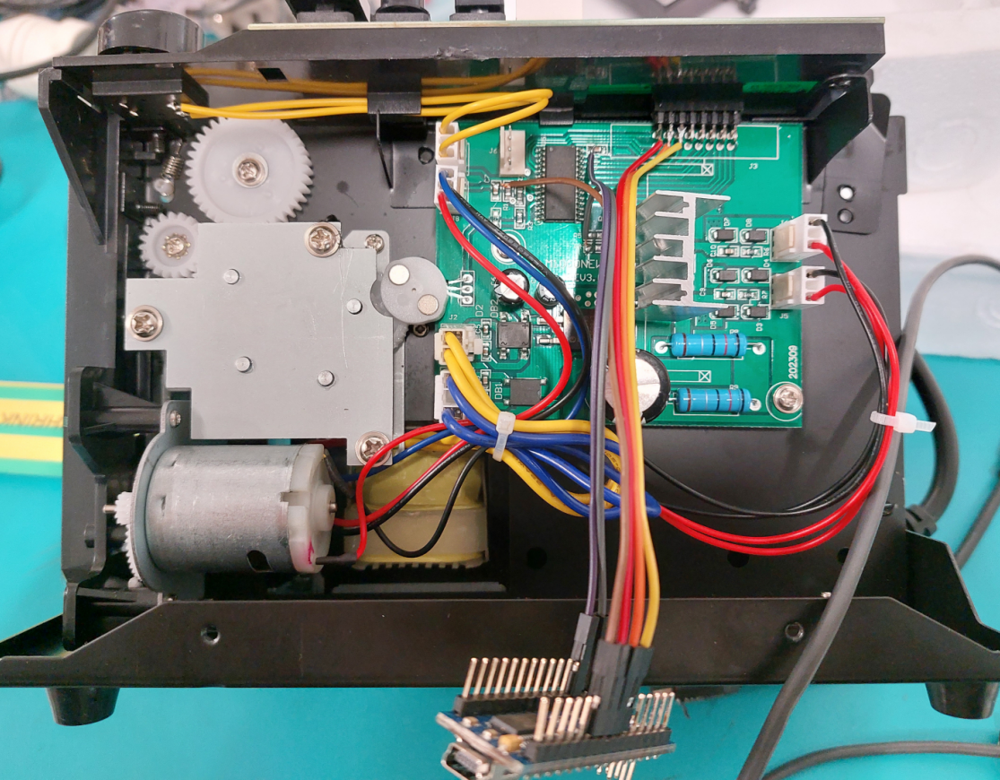

# Automatic Tape Length Control for M-1000 Dispenser

If you need to automatically change the tape length dispensed by your M-1000, this code is for you!

### Features:
- Changes the length of the tape every time the knife is activated.
- Power cycle the M1000 to activate or deactivate the module. This is useful if you want to run the dispenser normally.

### Setting the tape lengths:
1. Update the `distance` array to include your tape lengths. Minimum length is 20mm.
2. Set the `array_length` variable.
3. Upload.

**Note:** Just drill a hole in the back of the case to leave a USB permanently wired into the dispenser. Remember, there are dangerous voltages inside the unit.

